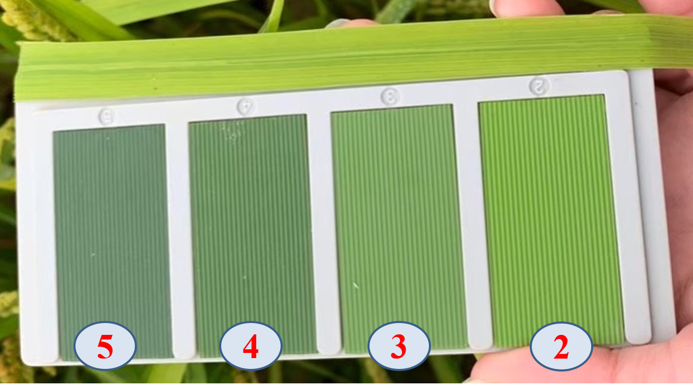
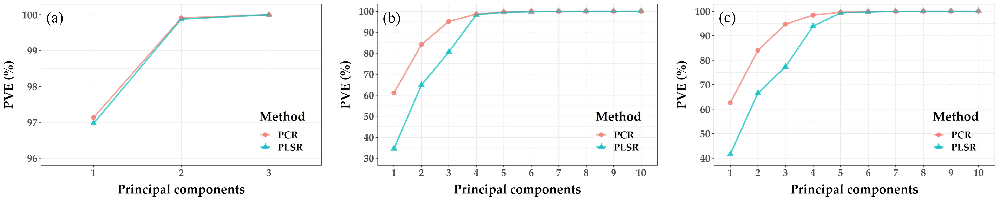
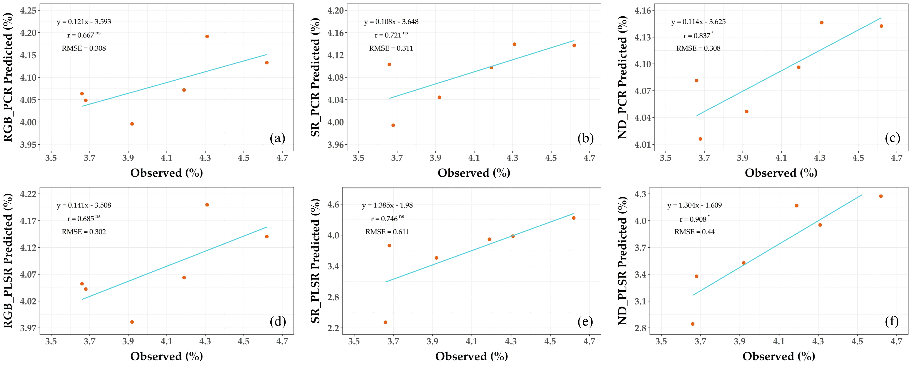

# Rice_XinYe
Rice leaf nitrogen content estimation via leaf color chart (LCC) and RGB-image.

## **利用LCC校正智慧型手機RGB影像探測水稻葉片氮含量之研究**
##### 李欣曄\* ，賴俊傑\* ，林汶鑫**
##### 國立屏東科技大學農園生產系

### 前言
>水稻 (*Oryza sativa* L.) 葉片氮含量為精準施肥之重要依據。然而，一般常用之植體化學檢驗方法除耗時費力，所使用之化學藥品亦對人體與環境具負面影響，因此許多非破壞性之葉片氮含量探測技術應運而生。由於葉片氮含量與葉片顏色的呈現具有高度相關，而葉色板 (leaf color chart, LCC) 更是現場對照水稻葉色常用之工具，可即時於現場與水稻葉片比對而約略判斷該植株是否氮素缺乏。然而，此方法屬於質性檢測，無法提供量化資訊作為決策依據。因此，本試驗嘗試利用影像分析之技術，量化水稻葉片的顏色呈現，並以水稻標準葉色板為校正依據，試圖透過圖像像素值之量化分析，現場定量水稻葉片氮含量。

### 材料與方法
>本試驗於國立屏東科技大學實習農場進行，栽種品種為‘高雄147’，並於幼穗分化期間進行數據採集。水稻單片葉片離尖端三分之一部位與葉色板 (Leaf Color Chart, LCC) 併置，同時以智慧型手機內置RGB相機取像 (Figure 1)。爾後，取樣該葉片進行凱氏氮測定葉片氮含量。圖像數據除利用葉片原始像素值 (RGB-based) (Equation 1)，亦嘗試以 simple ratio (SR-based) (Equation 2) 與 normalized difference (ND-based) (Equation 3) 計算方式與 LCC 進行校正，並分別以 principal component regression (PCR) 與 partial least square regression (PLSR) 建立預測模型。主成份數量之選擇則以 proportion of variance explained (PVE) 趨緩為依據。數據以7：3比例分為訓練與測試數據集。  
X = {R, G, B}, n = {2, 3, 4, 5};  
$$Equation\text{ }1:\text{    }{RGB(X) = Leaf(X)}$$  
$$Equation\text{ }2:\text{    }{SR(X) = Leaf(X) \over LCC_{n}(X)}$$  
$$Equation\text{ }3:\text{    }{ND(X) = {Leaf(X) - LCC_{n}(X)} \over {Leaf(X) + LCC_{n}(X)}}$$  
  
>  
>Figure 1. Illustration of leaf color chart (LCC). The numbers (LCCn; n = {2, 3, 4, 5}) indicate different color-state of each color panel.

### 結果與討論
>各式校正方法於PCR與PLSR中選取之成分數如 Figure 2 所示。RGB-based 之 PCR 與 PLSR 於第一主成分即達 97% 之解釋能力 (Figure 2a)，因此 RGB-based 模型僅採用第一主成份；SR-based 之 PCR 模型採用前三主成份，而 PLSR 模型則採用前四主成份 (Figure 2b)。ND-based 與 SR-based 相似，PCR 與 PLSR 亦分別採用至第三與第四主成分 (Figure 2c)。直接利用葉片RGB像素值進行葉片氮素預估，其建立之檢量模式表現效益不佳(rPCR=0.667ns、rPLSR=0.685ns) (Figure 3a, d)。另外，利用 LCC作為標準色版進行SR-based校正後，其所建立之檢量模式表現效能並無法明顯提升(rPCR=0.721ns、rPLSR=0.746ns) (Figure 3b, e)，顯見無法有效進行校正。而同樣以 LCC 作為標準色板進行 ND-based 校正後，其所建立之PCR 模型之檢量模式表現效能雖有提升(rPCR=0.837\*) (Fig. 3c)，但易發生過度高估或低估的情形 (slopePCR = 0.114)。另一方面，以 ND-based 校正後，利用PLSR 建立檢量模式，則其模式表現不僅提升(rPLSR=0.908\*)，且預估效能亦佳(slopePLSR= 1.304, RMSE = 0.44) (Fig. 3f)，整體模式表現較為理想。如上所述，利用葉色板作為水稻葉片之葉色標準色板進行校正，可提高智慧型手機 RGB 影像以非破壞性方式預估葉片氮含量之模式表現，其中以ND-based修正之 PLSR 模型具較佳表現。未來將持續修正水稻葉片之智慧型手機 RGB 影像，提高利用模式預估水稻葉片氮素含量之效能並落地使用，以提升水稻栽培時合理化施肥管理的效益。  
  
>  
>Figure 2. Screeplots for the RGB-based (a), SR-based (b), and ND-based (c) PCR and PLSR principal components.  
  
>  
>Figure 3. Validation of the RGB-based PCR (a), SR-based PCR (b), ND-based PCR (c), RGB-based PLSR (d), SR-based PLSR (e), and ND-based PLSR (f) models.
